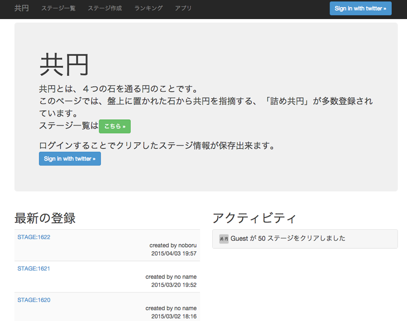
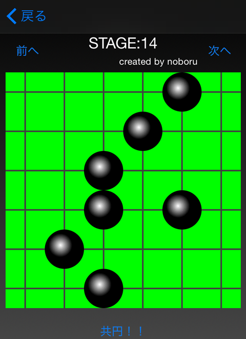
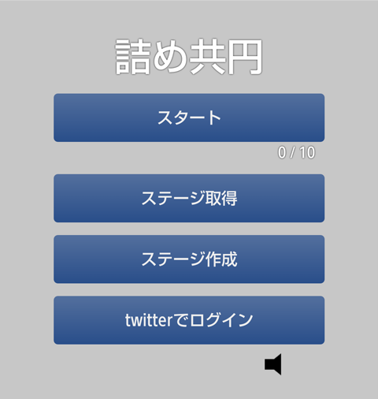
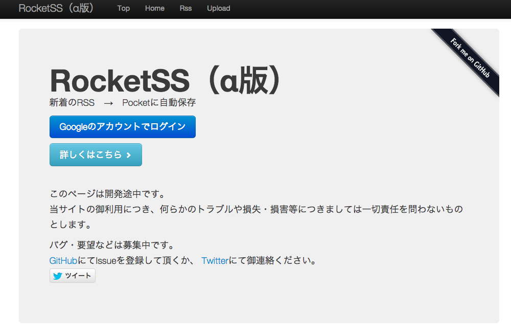

## Private Works

### <a href="https://play.google.com/store/apps/details?id=hm.orz.chaos114.android.slideviewer" target="_blank">SlideViewer(Android)</a>

### <a href="https://play.google.com/store/apps/details?id=hm.orz.chaos114.android.tethersetting" target="_blank">TetherSetting - 無料のテザリングアプリ -(Android)</a>

### <a href="http://my-android-server.appspot.com/" target="_blank">詰め共円(Python/Angular/CoffeeScript/GAE)</a>

### <a href="https://itunes.apple.com/jp/app/jieme-gong-yuan/id792426923?mt=8" target="_blank">詰め共円(iOS)</a>

### <a href="https://play.google.com/store/apps/details?id=hm.orz.chaos114.android.tumekyouen" target="_blank">詰め共円(Android)</a>

### <a href="https://play.google.com/store/apps/details?id=hm.orz.chaos114.android.kyouenchecker" target="_blank">共円チェッカー(Android)</a>

### <a href="http://rsspocket.appspot.com/" target="_blank">RocketSS(Java/CoffeeScript)</a>

### <a href="https://play.google.com/store/apps/details?id=hm.orz.chaos114.android.readitnow" target="_blank">Read It Now(Android)</a>

### <a href="https://play.google.com/store/apps/details?id=hm.orz.chaos114.android.irokae" target="_blank">色揃えるやつ(Android)</a>

## SNS / Posts

- <a href="https://github.com/noboru-i" target="_blank">GitHub: noboru-i</a>
- <a href="https://twitter.com/noboru_i" target="_blank">Twitter: noboru_i</a>
- <a href="https://www.facebook.com/noboru.ishikura" target="_blank">Facebook: noboru.ishikura</a>
- <a href="http://noboru.hatenablog.jp/" target="_blank">Hatena: noboru_i</a>
- <a href="http://qiita.com/noboru_i" target="_blank">Qiita: noboru_i</a>
- <a href="http://www.amazon.co.jp/registry/wishlist/12YWIZYF8XCDU" target="_blank">Amazon: ishikura.noboru</a>

## Skills

### Lauguages

- Java: 80%
- Kotlin: 50%
- Ruby: 60%
- JavaScript: 50%
- Swift: 60%
- Objective-C: 60%
- HTML: 50%
- CSS: 50%
- Python: 30%
- PHP: 60%
- SQL: 50%

### Frameworks

- Ruby on Rails: 60%
- Spring: 40%
- CodeIgniter: 60%
- Laravel: 50%
- Android SDK: 70%
- iOS SDK: 50%
- React: 30%
- Vue.js: 30%

### Middlewares

- MySQL: 40%
- PostgreSQL: 20%
- Redis: 40%
- NGINX: 30%
- ElasticSearch: 10%

### OTHER

- Git: 80%
- GitHub: 80%
- CircleCI: 70%
- Danger: 60%
- Design: 2%

## Company

Monstar Lab, Inc.  
デジタル・パートナー事業部 テクノロジスト
